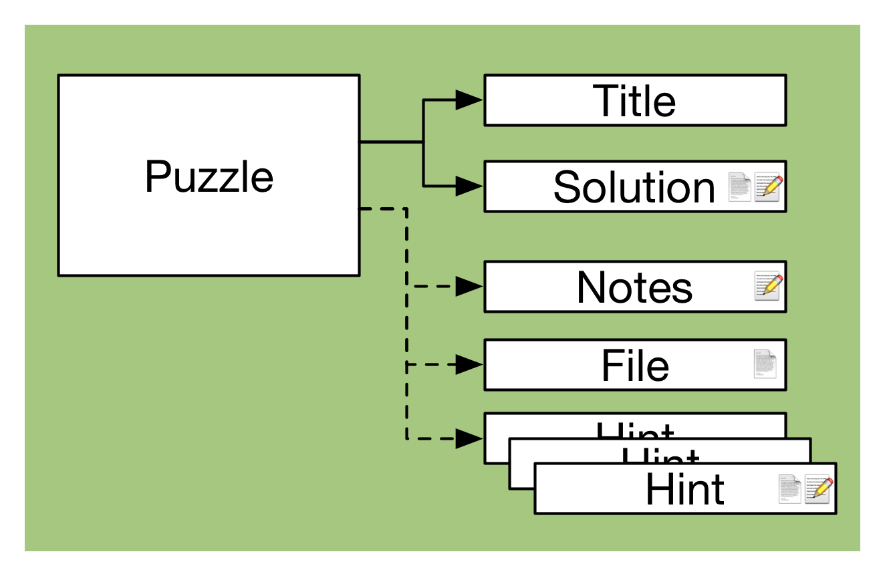
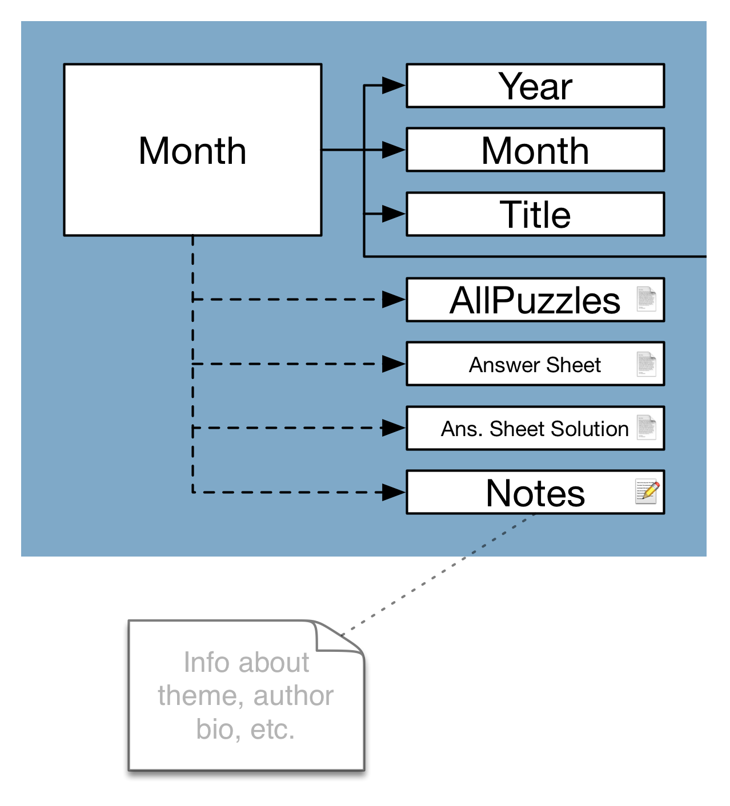
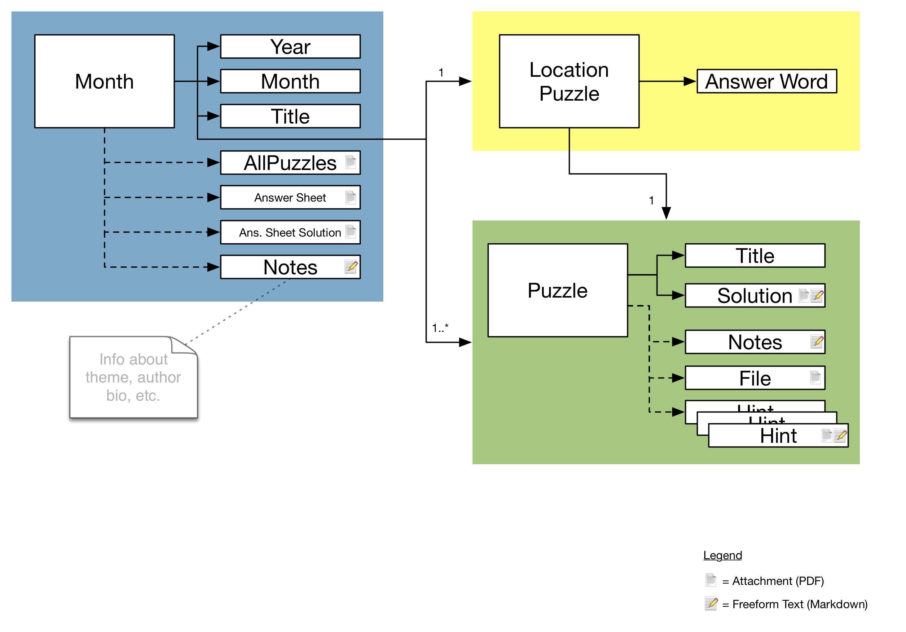

#Puzzled Pint Puzzle Archive Format

## Intent / In-Scope

- An intermediate data layer to take what we have (a collection of PDFs and freeform CMS text) and normalize it into structured data.
- Not a final, permanent, format.
- Data that can be easily parsed, massaged, and then loaded into a final format to seed the new website's database.
- Minimal and flexible.
- XML. Easy to hand-edit. Easy to start with a template. Easy to copy/paste from website into editor.
- Data format validation. `test.sh` wrappers calls to `xmllint` to look for bad XML, divergence from the DTD, or missing linked files.

## Out-of-Scope

- Wasting time arguing over the data structure. I had to start with something, then revised it a couple of times as I found non-conformate content. It's fairly solid now. Unless we run across more content that doesn't conform to the existing data structure, consider the DTD final for this task. Save the arguing for the final website's data structure.

## The Structure

- This is a “file based” database.
- Each month is in a `YYYY/MM` directory.
- Each month has a `month.xml` describing the month and its puzzles.
- There are also the various support files — puzzle PDFs, answer sheets, solutions, etc.
- Upon import, I was anal-retentive and renamed the puzzle PDFs to `{number}-{title}-{puzzle | solution}.pdf`. That let me better see what files mapped to what puzzle. Some of the original names were pretty silly and embarrassing (“mypuzzle.pdf” and “final, version 3” and such). We don't have to stick to this naming.
- The test app doesn't specifically test for this (yet?) but there should be no files in these folders that are not referenced in the XMLs. That is, the XML always points to files that have no local external dependencies (such as images, or links to other local files). It's possible that some things may have links out to external resources such as crossword solvers, anagram solvers, etc.

##month.xml

Each month folder holds a `month.xml` file. This describes the following:

- The month and its description.
- Informational text about the month (theme, authors, etc.)
- All puzzles, including location.
- Location puzzle answer word.
- Hints, if available.
- Answer sheet, if available.

They should all conform to the top level `month.dtd`. Look at the comments there for more info. A `sample_month.xml` file lives at the top level as an example to copy when adding new months.

##Validation

Run the top level `test.sh` script and this will spider into each year/month folder and:

- Validate the XML against the DTD using xmllint.
- Validate that any `href` attributes point to real files.
- Warn of any `href` attributes that point to external domains.

##Assorted Notes

All freeform text in the XML is Markdown. We don't have to stick to this — for example, we can render it as HTML upon database import — but it's a start. They should be considered [Github-flavored markdown](https://help.github.com/articles/github-flavored-markdown/). They occasionally make use of links, bold, italics, tables, and occasional code-blocks.

Linked files are typically PDF, but could technically be anything. We have a few media files here and there (MP3, MP4).

The hint file `./2015/06/00-location-hint1.html` hotlinks images on snout.org.

Missing solutions:

- January 2012
- February 2012
- March 2012 is missing both the LOCATION PUZZLE and the solution
- April 2012

For months with two location puzzles (Portland + Seattle), I only captured the Portland variant.

----------------------------------------

##Data Format

### The Puzzle

- The smallest “interesting” unit of data is the puzzle.
- The puzzle has, at minimum:
  - A title.
  - Content: freeform text and/or a linked [typically PDF] file.
  - A solution: freeform text and/or a linked [typically PDF] file.
- It can also have any number of hints (including zero). Any of these can also be freeform text and/or a linked file. In theory, the website could render these as progressive clues.

### The Location Puzzle

The Location Puzzle builds on the normal puzzle by including an official answer word.

### The Month

The Month is the largest unit of data in this format. It includes:

- Metadata — year, month, title.
- Freeform text, typically used to introduce the theme, include an author bio, and so on.
- A location puzzle.
- One or more puzzles.
- Optionally, an `allpuzzles.pdf`.
- Optionally, an answer sheet.
- Optionally, an answer sheet with solutions filled in.

### Full Diagram

